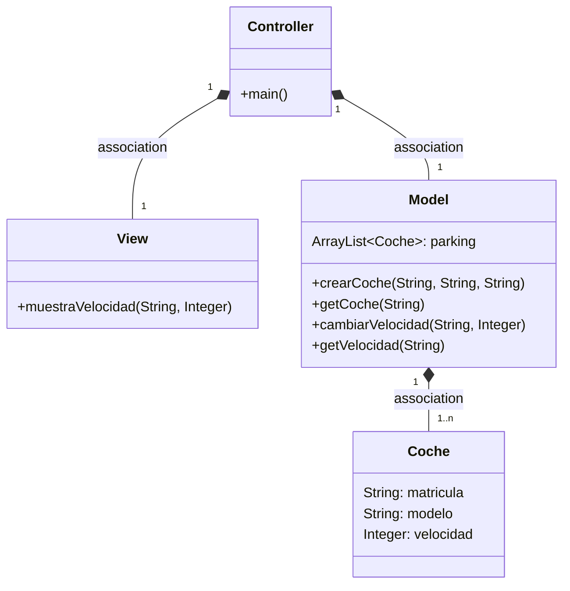
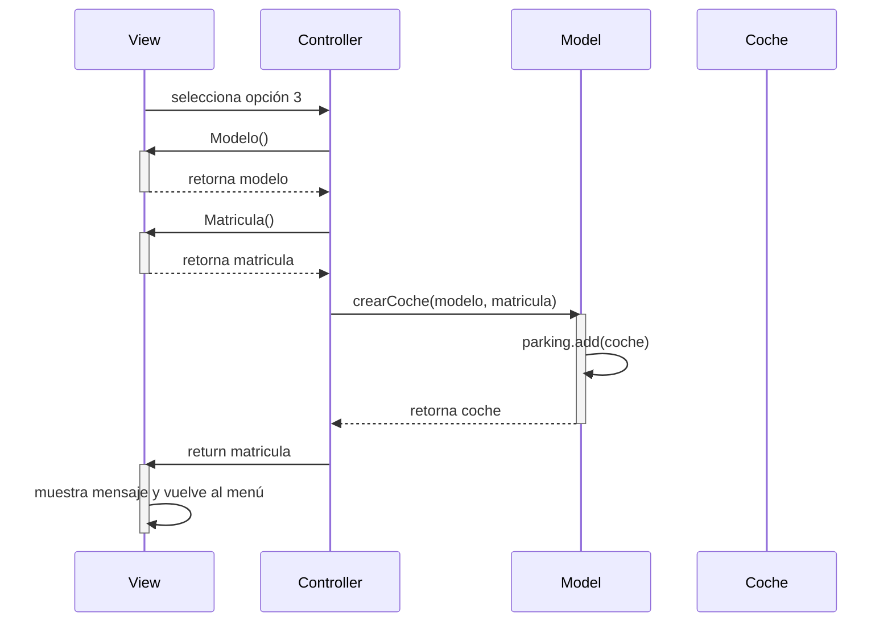

# Arquitectura MVC

Aplicación que trabaja con objetos coches, modifica la velocidad y la muestra

---
## Diagrama de clases:

```mermaid
classDiagram
    class Coche {
        String: matricula
        String: modelo
        Integer: velocidad
    }
      class Controller{
          +main()
      }
      class View {+muestraVelocidad(String, Integer)}
      class Model {
          ArrayList~Coche~: parking
          +crearCoche(String, String, String)
          +getCoche(String)
          +cambiarVelocidad(String, Integer)
          +getVelocidad(String)
      }
    Controller "1" *-- "1" Model : association
    Controller "1" *-- "1" View : association
    Model "1" *-- "1..n" Coche : association
      
```

---

## Diagrama de Secuencia

```mermaid
sequenceDiagram
participant View
participant Controller
participant Model
participant Coche

    View->>Controller: selecciona opción 3
    Controller->>View: Modelo()
    activate View
    View-->>Controller: retorna modelo
    deactivate View
    
    Controller->>View: Matricula()
    activate View
    View-->>Controller: retorna matricula
    deactivate View
    
    Controller->>Model: crearCoche(modelo, matricula)
    activate Model
    Model->>Model: parking.add(coche)
    Model-->>Controller: retorna coche
    deactivate Model
    
    Controller->>View: return matricula
    activate View
    View->>View: muestra mensaje y vuelve al menú
    deactivate View
```
