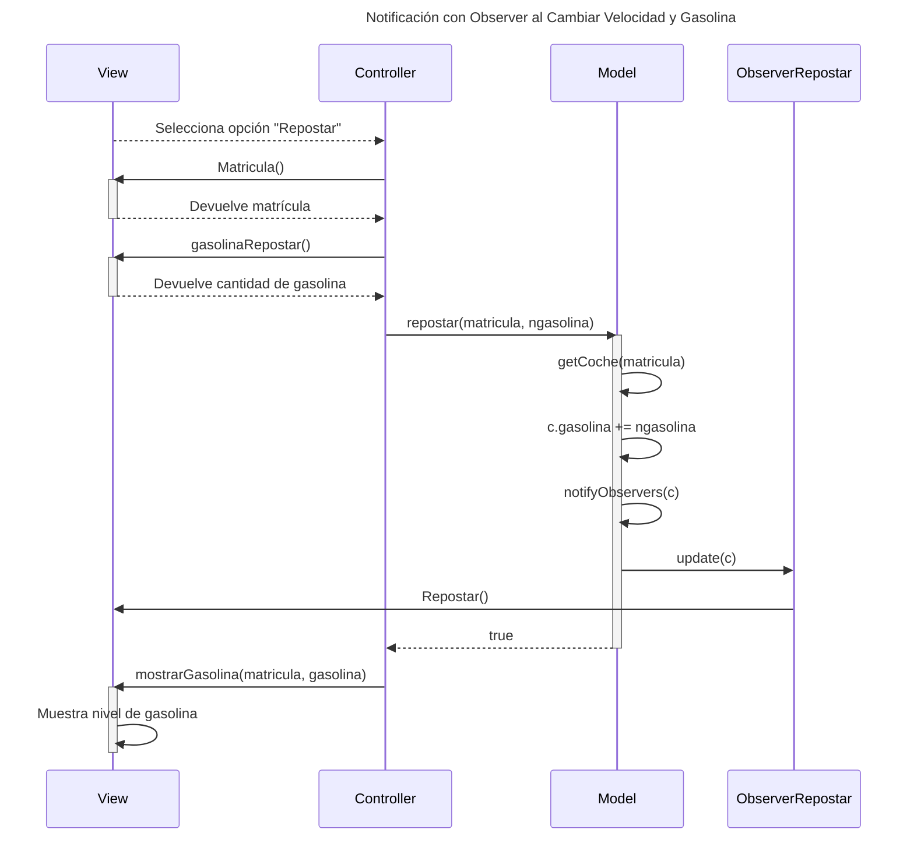
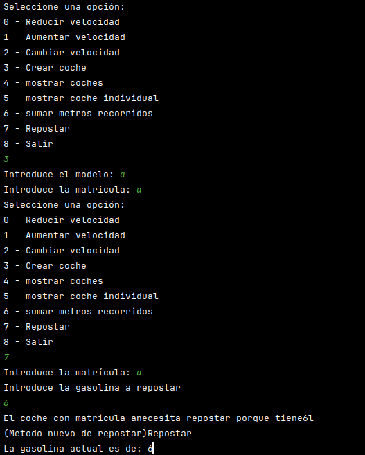
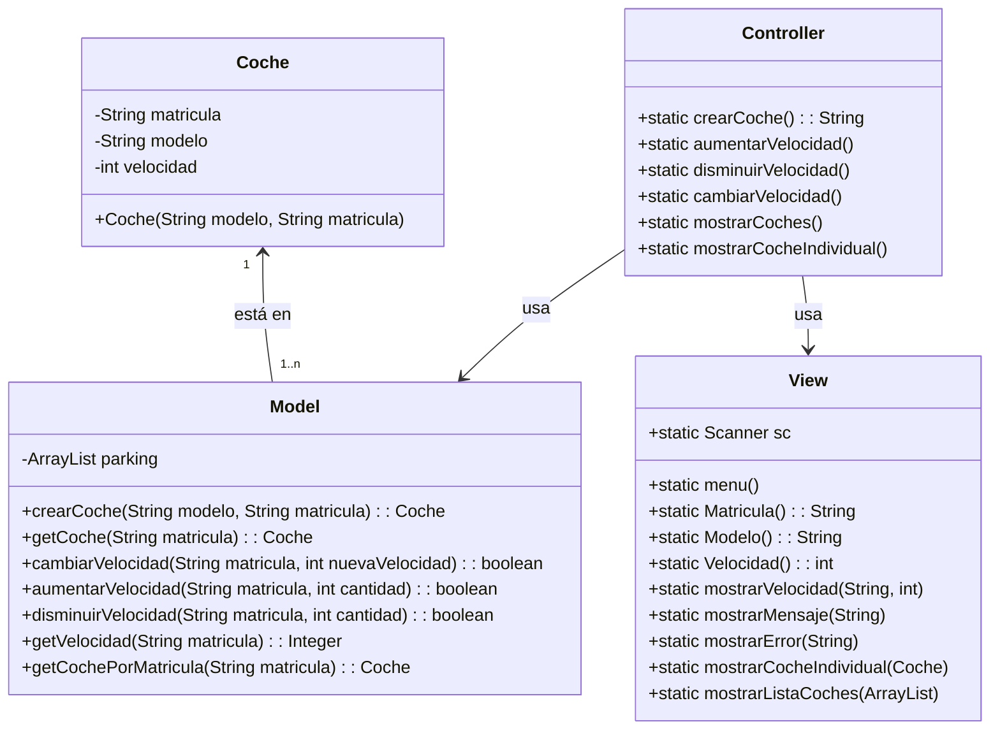
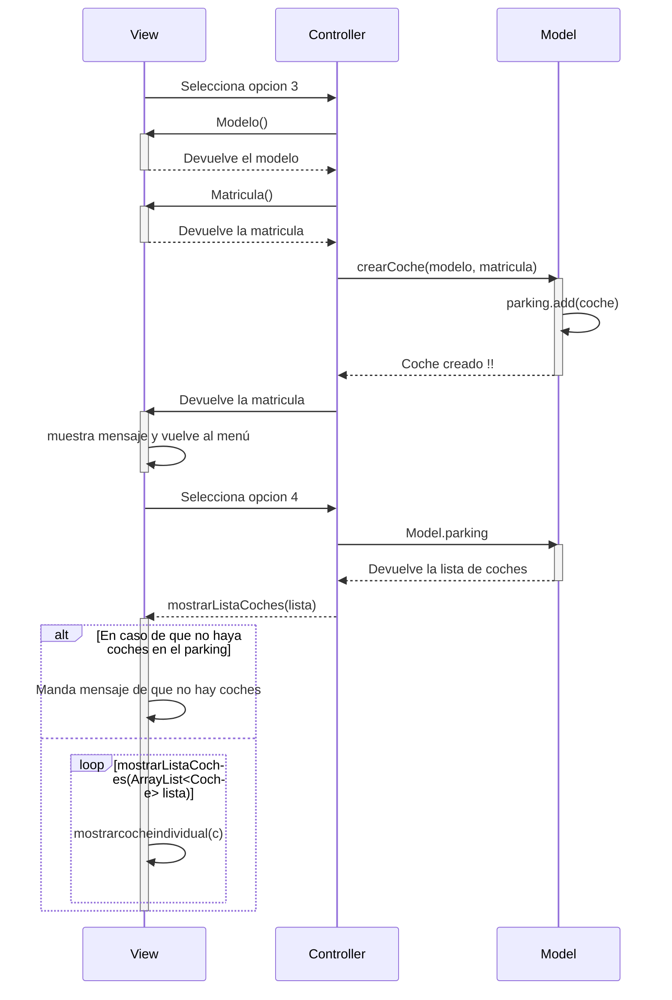
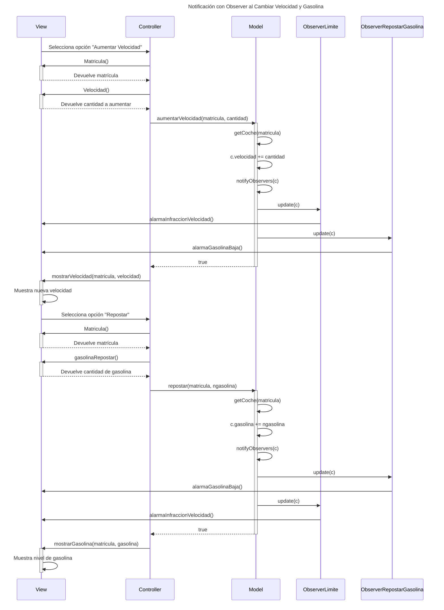

# Pensamiento previo a realizar el examen

### La verdad simplemente he pensado en implementar el avanzar igual al que subir de velocidad ya que es lo mismo porque estas añadiendo por lo cual, este sigue la misma estructura
### Segundo, al fin y al cabo la gasolina va de la misma manera ya que la estas subiendo al repostar 

## Para la funcion de avanzar sigue todo igual, simplemente utilizo el view.matricula y el view.metrosRecorridos
## La funcion repostar solo pide la matricula y la gasolina a repostar y , a este metodo tambien le añadi el coger la gasolina dle model para asi poder realizar lo de bajar la gasolina en funcion a los metros recorridos

## Añadi todo al menu con sus opciones , al fin y al cabo fue todo seguir la misma estructura que tenian los otros metodos

# Comprobado todo, :D

# Arquitectura MVC

Aplicación que trabaja con objetos coches, modifica la velocidad y la muestra

---
## Diagrama de Secuencia con Observer EXAMEN

# Pensamiento previo a realizar el examen (2 parte, observer)

### He implementado la misma logica que tenia ya hecha de un observer parecido, so simplemente no hay mucho nad mas que añadir
### Segundo, al fin y al cabo una comparacion en el observerRepostar de que cuando la gasolina es <10 pues manda un mensaje en la view, en este caso no le he pasado parametros de matricula ni gasolina ya que no son pedidos

## Luego cree el marmaid con la logica que tenia ya echa, pero sin poner los otros observers que tenia

# Comprobado todo, y finiquitau, gracias por el gift damian :D

## FURRULA :

## Diagrama de clases:

---

## Diagrama de Secuencia

## Diagrama de Secuencia con Observer

